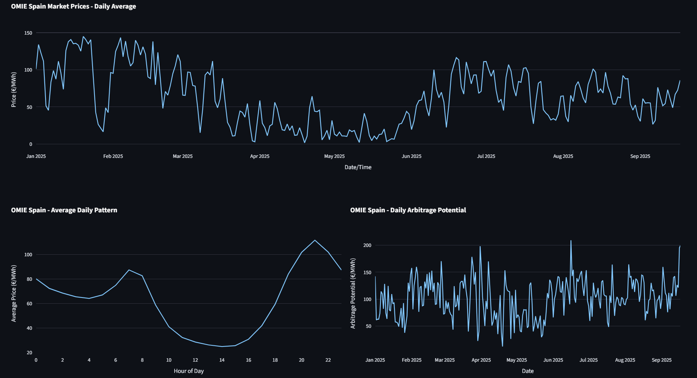
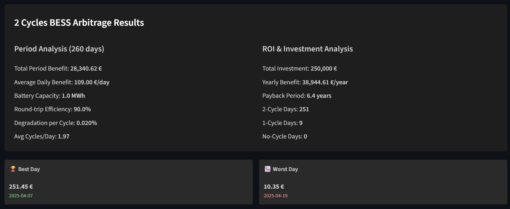
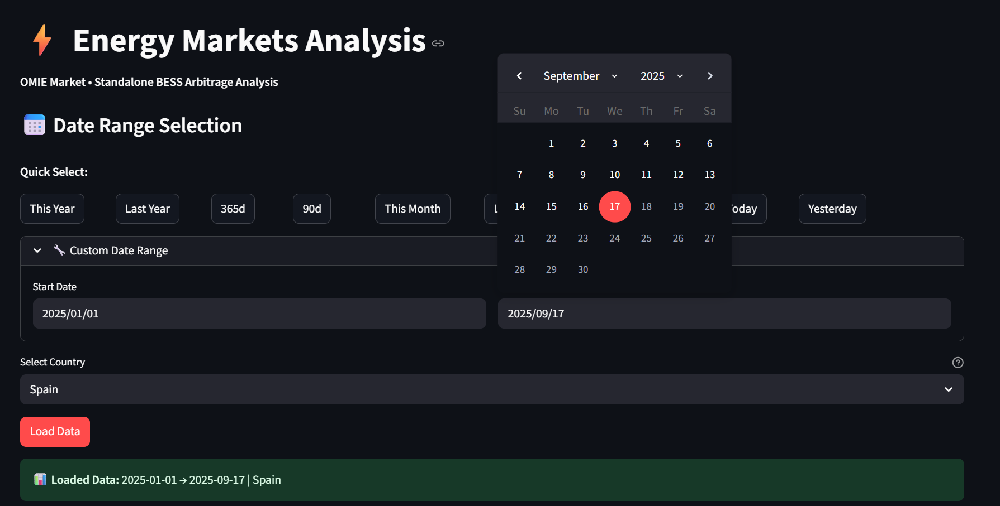
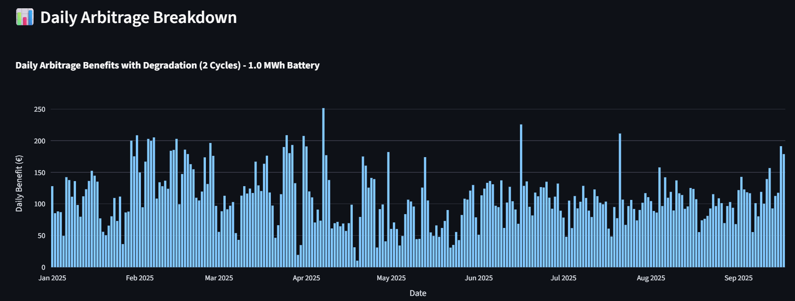

# ⚡ Energy Markets Analysis Dashboard

OMIE Market • Standalone BESS Arbitrage Analysis

**Explore the project in [omiemarketanalysis.streamlit.app](https://omiemarketanalysis.streamlit.app/)**

A Streamlit application for analyzing OMIE market historic data and calculating BESS arbitrage opportunities in that market.





-----

## 📊 Project Overview

This dashboard provides sophisticated analysis tools for energy professionals, researchers, and investors interested in the Iberian electricity market (Spain and Portugal). It combines market data visualization with simple BESS arbitrage calculations to understand possible opportunities.

-----

## 🎯 Key Features

  * **📈 OMIE Market Analysis:** Electricity prices monitoring and visualization for Spain and Portugal
  * **🔋 BESS Arbitrage Calculator:** Benefit calculator for BESS in arbitrage mode doing 1 or 2 cycles/day
  * **📅 Flexible Time Ranges:** Totally customizable time ranges allow flexible analyses
  * **📊 Interactive Visualizations:** Plotly-powered charts and graphs to provide detailed data
  * **💰 Financial Modeling:** Degradation models, ROI calculations, and payback periods

-----

## 🔧 Technical Architecture

```
📁 project/
├── 🐍 main.py                  # Application entry point
├── ⚙️ config.py                # Configuration and styling
├── 🎨 ui_components.py         # User interface components
├── 📊 data_loader.py           # Data loading and caching
├── 📈 plotting_utils.py        # Visualization functions
├── 🧮 statistics_utils.py      # Statistical calculations
├── ⚡ arbitrage_calculator.py  # Battery arbitrage algorithms
├── 📋 omie_tab.py             # Market analysis tab
└── 🔋 arbitrage_tab.py        # Arbitrage analysis tab
```
-----

## ⚙️ Technology Stack

| Component | Technology | Purpose |
| :--- | :--- | :--- |
| **Frontend** | Streamlit | Interactive web application |
| **Data Processing** | Pandas | Data manipulation and analysis |
| **Visualizations** | Plotly | Interactive charts and graphs |
| **Market Data** | OMIE API | Iberian electricity market data |

-----

## 📋 Features Breakdown

### 1\. OMIE Market Analysis

  * **Price Monitoring:** Electricity prices from the Iberian market
  * **Multiple Aggregation Levels:** Hourly, daily, monthly, and yearly views
  * **Market Statistics:** Price volatility, min/max values, and trends

### 2\. Battery Arbitrage Calculator

  * **Dual Strategy Support:** 1-cycle and 2-cycle daily operations
  * **Financial Modeling:**
      * Round-trip efficiency calculations
      * Battery degradation modeling
      * ROI and payback period analysis
  * **Customizable Parameters:**
      * Battery capacity (MWh)
      * System costs (€/MWh)
      * Efficiency rates
      * Degradation per cycle







-----

## 💡 Business Applications

### Energy Professionals

  * **Market Analysis:** Check price patterns and volatility
  * **Investment Decisions:** Evaluate potential BESS project viability
  * **Risk Assessment:** Analyze market conditions and trends

### Researchers & Analysts

  * **Academic Research:** Market behavior studies
  * **Policy Analysis:** Help understand historical renewable integration impacts
  * **Forecasting Models:** Historical data visualization for prediction algorithms

### Investors & Developers

  * **BESS Modeling:** BESS behavior modelled with 2 different strategies
  * **Financial Modeling:** Benefits calculations based BESS conditions
  * **Market Timing:** Comparison between investment in different market periods

-----

## 🛠️ Installation & Setup

### Quick Start

```bash
# Clone the repository
git clone https://github.com/julio-d/energy_market_analysis.git

cd energy_market_analysis

# Install dependencies
# Clone the repository
git clone https://github.com/julio-d/energy_market_analysis.git

cd energy_market_analysis

# Install dependencies
pip install -r requirements.txt

# Run the application
# Run the application
streamlit run main.py
```

### Dependencies

  * `streamlit>=1.28.0`
  * `pandas>=1.5.0`
  * `plotly>=5.15.0`
  * `numpy>=1.24.0`

-----

## 🔮 Future Enhancements

### Planned Features

  * **Machine Learning Integration:** Price prediction models
  * **BESS Revenue Stacking:** Simulation of new revenue sources for BESS
  * **Multi-Market Support:** Other electricity markets

### Technical Improvements

  * **Database Integration:** Faster data retrieval, reduce API dependency
  * **Microservices Architecture:** Containerized deployment

-----

## 📞 Contact & Support

  * **Email:** julioduarte92@outlook.com

-----

## 📄 License

This project is licensed under the MIT License - see the `LICENSE` file for details.

-----

Built with ❤️ for the energy transition

-----
